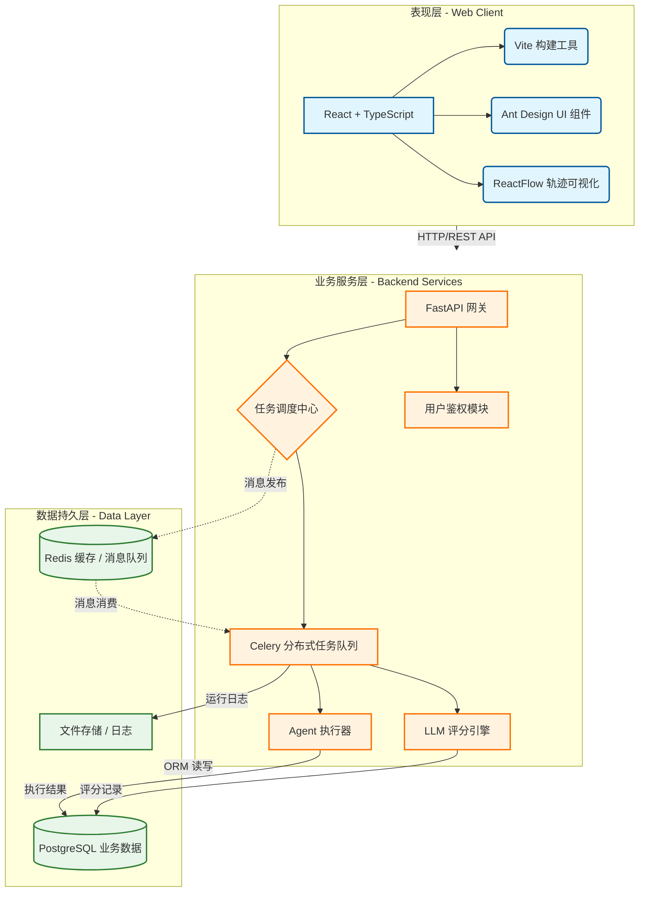

# AgentFlow-Eval 系统架构图

```mermaid
graph TD
    %% 定义样式
    classDef frontend fill:#e1f5fe,stroke:#01579b,stroke-width:2px;
    classDef backend fill:#fff3e0,stroke:#ff6f00,stroke-width:2px;
    classDef data fill:#e8f5e9,stroke:#2e7d32,stroke-width:2px;

    subgraph frontend["表现层 - Web Client"]
        A[React + TypeScript] --> B(Vite 构建工具)
        A --> C(Ant Design UI 组件)
        A --> D(ReactFlow 轨迹可视化)
    end

    subgraph backend["业务服务层 - Backend Services"]
        E[FastAPI 网关] --> F{任务调度中心}
        F --> G[Celery 分布式任务队列]
        G --> H[Agent 执行器]
        G --> I[LLM 评分引擎]
        E --> J[用户鉴权模块]
    end

    subgraph datalayer["数据持久层 - Data Layer"]
        K[(PostgreSQL 业务数据)]
        L[(Redis 缓存 / 消息队列)]
        M[文件存储 / 日志]
    end

    %% 层级之间的连接
    frontend -->|HTTP/REST API| backend
    backend -->|ORM 读写| datalayer
    F -.->|消息发布| L
    L -.->|消息消费| G
    H -->|执行结果| K
    I -->|评分记录| K
    G -->|运行日志| M

    %% 应用样式
    class A,B,C,D frontend;
    class E,F,G,H,I,J backend;
    class K,L,M data;
```
